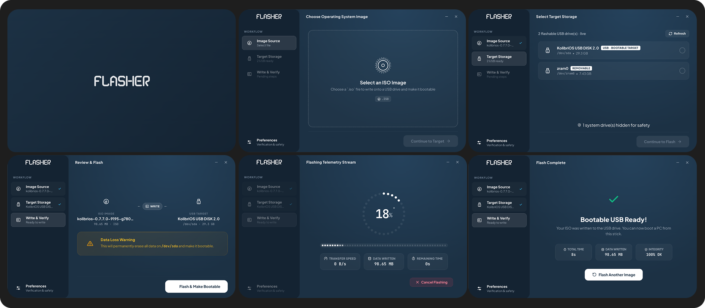

---

# Flasher

An open source, safe, and fast OS image burner for USB flash drives and SD cards.

---



Flasher writes raw disk images directly to removable USB drives and memory cards. Built with Electron, React, and TypeScript, it combines a clean desktop interface with direct block streaming, automated partition unmounting, surface defect scanning, and post write checksum verification.

## Why Flasher?

Many image writing utilities bundle proprietary analytics, display third party promotions, or execute entire desktop web browsers as root.

Flasher is built around three principles:

1. Safety by Default: The application detects system storage and protects active operating system disks from accidental overwrites. A dedicated review step requires confirmation of target geometry and format parameters before destructive writes begin.
2. Privilege Separation: The user interface runs without root privileges. Raw disk operations are isolated to a compact helper script invoked through standard system authorization mechanisms (Polkit `pkexec` on Linux, UAC on Windows, `osascript` on macOS).
3. Open Source and Clean: Licensed under Apache 2.0. No telemetry, no advertisements, no tracking, and no background network calls during write jobs.

## Supported Formats

Flasher supports raw disk images:
- `.iso` (Standard optical and hybrid installation media)
- `.img` (Raw disk images and embedded appliance systems)
- `.raw` (Byte for byte storage dumps and virtual machine exports)

Archive formats such as zip, tar, or gz are deliberately unsupported. Flasher operates directly on raw block images to ensure predictable streaming, exact sector alignment, and accurate cryptographic checksum verification.

## Key Features

- Direct Block Streaming: Streams raw image data directly to block devices with configurable buffer sizing (standard 2 MB and high speed 4 MB chunks).
- Four Stage Visual Workflow: Linear navigation across Image Source, Target Storage, Write & Verify, and Review & Confirm screens.
- Circular Status Tracking: Sidebar indicators display completed workflow steps, updating interactively when settings or target selections change.
- Automated Partition Handling: Detects mounted filesystems on the target drive and cleanly unmounts all child partitions across Linux, Windows, and macOS prior to opening write handles.
- Pre Write Surface Scanning: Optional surface verification reads sectors before writing to detect bad blocks, worn flash cells, and counterfeit storage media.
- Zero Out Partition Pre Wipe: Option to clear legacy MBR and GPT partition structures from sector zero before streaming the bootable disk image.
- Dual Formatting Modes: Supports quick sector erasure for fast deployment or full format zero fill passes with sector defect detection.
- Windows Sector Alignment: Enforces 512 byte sector alignment boundaries on Windows physical drives with automatic zero padding on trailing bytes.
- macOS Character Device Acceleration: Automatically maps macOS disk nodes from buffered block devices (`/dev/disk*`) to unbuffered raw character devices (`/dev/rdisk*`).
- Multi Algorithm Checksum Verification: Validates written data against the source image using sequential SHA-256 or MD5 passes to guarantee bootable integrity.
- Operating System Drive Protection: Automatically inspects root (`/`), boot (`/boot`), and system partitions to prevent accidental overwrites of internal OS disks.
- Live Telemetry Stream: Displays live write speed in MB/s, total bytes transferred, elapsed duration, ETA calculations, and active operation phases.
- Configurable Preferences: Centralized settings view covering verification switches, auto eject behavior, turbo mode, sleep prevention, single USB auto selection, desktop notifications, and completion chimes.

---

## Supported Operating Systems

| Operating System | Support Status | Elevation Mechanism | Device Mapping |
| ---------------- | -------------- | ------------------- | -------------- |
| Ubuntu / Debian  | Supported      | Polkit (`pkexec`)   | `/dev/sdX`     |
| Fedora / RHEL    | Supported      | Polkit (`pkexec`)   | `/dev/sdX`     |
| Arch / Manjaro   | Supported      | Polkit (`pkexec`)   | `/dev/sdX`     |
| Linux Mint       | Supported      | Polkit (`pkexec`)   | `/dev/sdX`     |
| openSUSE         | Supported      | Polkit (`pkexec`)   | `/dev/sdX`     |
| Windows 10/11    | Supported      | UAC Elevation       | `PhysicalDriveN` |
| macOS 12+        | Supported      | `osascript` / auth  | `/dev/rdiskN`  |

---

## Quick Start

### Prerequisites

Ensure you have the following installed on your development machine:

- Node.js: Version 18.x or later (Node 20 LTS recommended)
- npm: Version 9.x or later
- Linux Dependencies: `polkit` (`pkexec`), `lsblk`, `umount`

### Clone and Install

```bash
git clone https://github.com/flasher-project/flasher.git
cd flasher
npm install
```

### Run in Development

Start the Vite development server and launch the Electron application:

```bash
npm run dev
```

The application will start in development mode with Hot Module Replacement (HMR) enabled for the user interface.

### Build Production Bundle

To compile TypeScript and create the production bundle in `out/`:

```bash
npm run build
```

To generate installers and executables for your target platform:

- Windows Installer (NSIS Setup & Portable):
  ```bash
  npm run build:win
  ```
- macOS (DMG & Zip):
  ```bash
  npm run build:mac
  ```
- Linux (AppImage, Deb, RPM):
  ```bash
  npm run build:linux
  ```
- All Platforms:
  ```bash
  npm run build:all
  ```

Packaged installers and executables are placed in the `dist/` directory.

## Step by Step Usage

1. Image Source:
   Click "Browse Image File" or drag and drop any `.iso`, `.img`, or `.raw` file into the main dropzone. Flasher inspects the file, extracts size information, detects partition schemes (MBR, GPT, Hybrid), and checks target system compatibility.
2. Target Storage:
   Select a removable USB flash drive or SD card from the detected devices list. Flasher continuously polls storage devices every two seconds to reflect hotplugged hardware automatically. Operating system drives are protected and disabled by default.
3. Write & Verify:
   Review the transfer topology, capacity checks, and filesystem transitions. Click "Flash & Make Bootable" to proceed.
4. Review & Confirm:
   Inspect the final confirmation card detailing target device path, capacity, source filename, format pass mode, and post write checksum validation. Click "Erase & Flash" to initiate the write sequence.
5. Authenticate and Write:
   Enter your administrator credentials when prompted by the system Polkit, UAC, or macOS dialog. Flasher unmounts active partitions, clears legacy structures if configured, streams raw image data, and runs the checksum validation pass.
6. Eject and Boot:
   When verification completes, target storage is flushed to disk and cleanly unmounted. The USB drive is ready to boot on your target hardware.

## Project Structure

```
flasher/
├── src/
│   ├── main/                   # Electron main process
│   │   ├── index.ts            # Application lifecycle and IPC handlers
│   │   ├── drive-scanner.ts    # Drive detection using drivelist with polling
│   │   ├── privilege.ts        # Operating system permission checks
│   │   ├── elevated-writer.ts  # Disk writer orchestration
│   │   └── elevated-helper.ts  # Isolated root helper script invoked via pkexec
│   ├── preload/                # Preload context bridge
│   │   └── index.ts            # Typed window.flasher bridge interface
│   ├── renderer/               # React 18 frontend
│   │   └── src/
│   │       ├── App.tsx         # Main application component and state machine
│   │       ├── index.css       # Design tokens and styling
│   │       ├── assets/
│   │       │   ├── icons/      # Vector icons, icon.svg, and wordmark.svg
│   │       │   └── img/        # Application showcase images (all.png)
│   │       └── components/     # UI components (icons, modals, step views)
│   └── shared/                 # Shared contracts and utilities
│       ├── types.ts            # Type definitions (DriveInfo, FlashProgress, etc.)
│       ├── constants.ts        # Chunk size and buffer configuration
│       ├── write-utils.ts      # Sector alignment and chunk size helpers
│       └── formatters.ts       # Byte size, speed, and time formatting helpers
├── .agents/                    # Customization rules and agent skills
│   └── skills/
│       ├── humanize/           # Human technical writing guidelines without emojis
│       └── readme-writing/     # Open source README authoring guidelines
├── electron.vite.config.ts     # Multi target Vite build configuration
├── package.json
└── tsconfig.json
```

## Security Model

Writing directly to hardware block devices requires root privileges on Unix like operating systems and administrative access on Windows. Flasher minimizes security exposure through privilege separation:

- The main Electron process and Chromium renderer run entirely under your unprivileged user account.
- When flashing begins, an isolated helper script (`elevated-helper.js`) executes with elevated permissions.
- The helper script reads job parameters from a temporary JSON descriptor, unmounts active partitions, writes raw data, executes `fsync`, and exits immediately.
- No arbitrary shell strings are exposed to or constructed by the UI layer.

For technical details, see [ARCHITECTURE.md](./ARCHITECTURE.md) and [SECURITY.md](./SECURITY.md).

## Documentation Links

- [Contribution Guidelines (CONTRIBUTING.md)](./CONTRIBUTING.md): Learn how to set up the development environment, submit bug reports, and create pull requests.
- [Architecture Guide (ARCHITECTURE.md)](./ARCHITECTURE.md): Technical documentation covering process separation, IPC contracts, write pipelines, and sector alignment.
- [Troubleshooting Guide (docs/TROUBLESHOOTING.md)](./docs/TROUBLESHOOTING.md): Solutions for Polkit dialogs, drive detection, locked partitions, surface scanning, and sector verification.
- [Code of Conduct (CODE_OF_CONDUCT.md)](./CODE_OF_CONDUCT.md): Standards for our open source community.
- [Security Policy (SECURITY.md)](./SECURITY.md): Vulnerability reporting procedures and defensive design notes.
- [Changelog (CHANGELOG.md)](./CHANGELOG.md): Record of changes and release history.

## License

Flasher is distributed under the Apache License, Version 2.0. See [LICENSE](./LICENSE) for the full license text.
